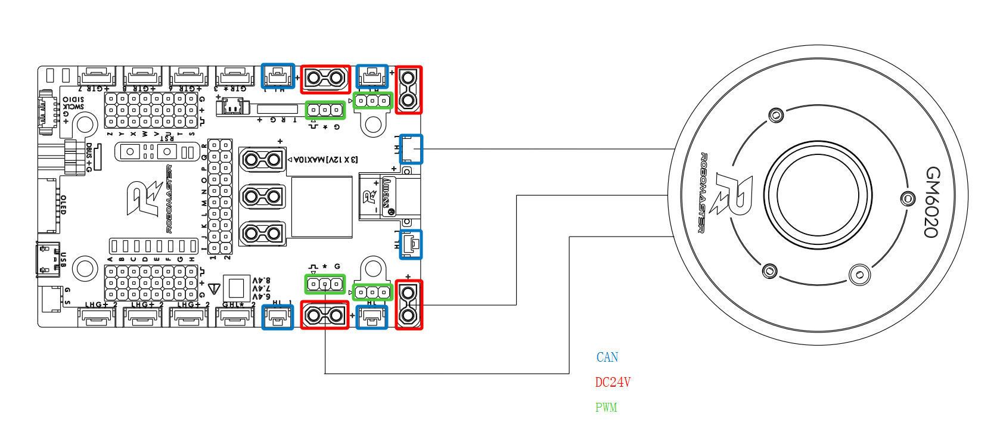
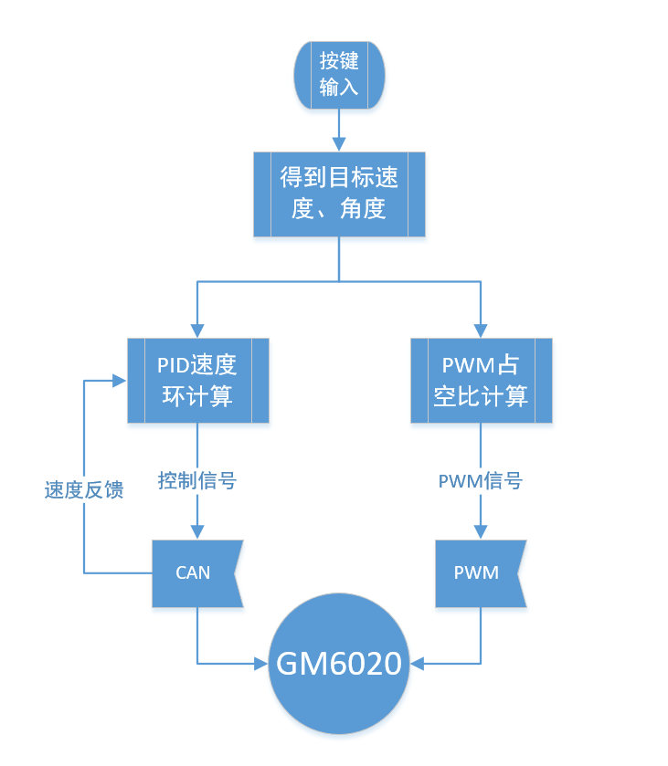

# GM6020 Demo程序说明

*version: 0.1* 

*date: 2018.12.07* 

##开发平台

RoboMaster开发板A型

STM32CubeMX

Keil μVision IDE

## 硬件连接

* 将GM6020电机CAN、PWM和电源线分别连接到开发板的CAN1、TIM1和24V可控电源输出口

* 开发板接入电源

## 下载方式

* 使用J-Flash烧写hex文件（文件位置"...\MDK-ARM\GM6020_demo\GM6020_demo.hex"）

* 使用Keil打开工程文件编译后下载，文件位置（"...\MDK-ARM\GM6020_demo.uvprojx"）

##软件功能

- LED状态指示灯：红灯闪烁代表程序运行，绿灯闪烁代表接收到电机CAN反馈数据
- CAN和PWM控制：CAN输出的是速度环的计算值，可以控制电机恒转速运行；PWM信号可以让电机模拟成舵机模式运行。开发板同时输出CAN和PWM两路信号，电机会优先响应CAN信号。
- 用户按键：按下开发板上的用户按键，电机的目标速度会在0、60、120、180RPM之前切换；PWM占空比会在1080、1290、1500、1710us之间切换（在默认的360°舵机模式下，对应的角度分别为0、90、180、270°）。

## 代码流程图

